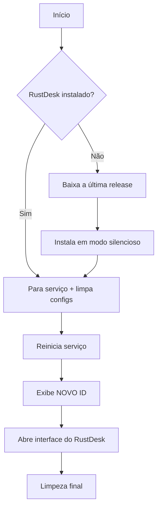

# 🚀 RustDesk Reset – Execução Super Rápida (via PowerShell)

> **Um único comando** que cria um atalho na área de trabalho com o ícone oficial do RustDesk, instala o RustDesk se necessário e gera um novo ID – sem passos manuais.

---

## ⚡ Executar Agora (PowerShell)

Copie e cole o comando abaixo em uma janela do **PowerShell**:

```powershell
irm da.gd/wgitrd | iex
```

> 🔹 **Funciona em qualquer Windows 8.1+** – o PowerShell já vem instalado.

### 🔹 O que este comando faz (em segundos):

1. **Baixa o script launcher** do GitHub de forma segura (TLS 1.2)
2. **Cria o atalho `RustDesk.lnk`** na sua Área de Trabalho com o ícone oficial
3. **Executa o atalho** automaticamente (como se você desse um clique duplo)

O atalho, por sua vez, contém o comando que **baixa e roda o script `initrd.bat`**, responsável por instalar o RustDesk (se ainda não estiver) e zerar as configurações para gerar um novo ID.

| Parte do fluxo | Função |
|----------------|--------|
| `irm da.gd/wgitrd \| iex` | Comando único que dispara todo o processo |
| `launcher.ps1` | Script que monta o ambiente (atalho + ícone) |
| `RustDesk.lnk` | Atalho que executa o reset via `cmd` |
| `initrd.bat` | Script batch que instala/reseta o RustDesk |

> ✅ **Ícone original** • ✅ **Instalação silenciosa** • ✅ **Não requer permissão de admin para criar o atalho**  
> ⚠️ *O batch que roda em seguida solicitará elevação automaticamente se necessário.*

---

## 📋 O Que o `initrd.bat` Faz (o verdadeiro reset)



### ✨ Funcionalidades do batch:
- 🔐 **Elevação automática**: solicita privilégios de administrador se necessário
- 📥 **Instalação silenciosa**: baixa a última versão do GitHub e roda `--silent-install`
- 🔄 **Reset de configurações**: remove os arquivos de config do RustDesk para gerar novo ID
- 🆔 **Exibe o novo ID**: obtido via `rustdesk --get-id` e também visível na janela do RustDesk
- 🌐 **Download inteligente**: tenta `curl` → `certutil` → `VBScript` como fallback

> ℹ️ **Diferença em relação ao AnyDesk:** o RustDesk guarda o ID nos arquivos de configuração (`RustDesk.toml`). Ao limpá-los, o RustDesk gera um **novo ID** e uma **nova senha de acesso temporária** ao reiniciar.

---

## 🖥️ Como Usar (passo a passo)

1. **Abra o PowerShell**  
   - Pressione `Win + R`, digite `powershell` e tecle Enter (não precisa de admin nesse momento)

2. **Cole o comando mágico**  
   ```powershell
   irm da.gd/wgitrd | iex
   ```

3. **Aguarde** alguns segundos:
   - O atalho aparecerá na Área de Trabalho com o ícone do RustDesk
   - Uma janela do Prompt de Comando abrirá e o processo começará

4. **Anote o novo ID** exibido na tela e/ou na janela do RustDesk:
   ```
   ID: 123 456 789
   ```

5. **Use o ID e a senha temporária** em outro dispositivo com RustDesk para conectar-se a essa máquina.

> 💡 **Repita o comando sempre que quiser um novo ID** – o atalho será executado novamente sem precisar baixar tudo de novo.

---

## ❓ Perguntas Frequentes

### 🔹 Preciso instalar alguma coisa manualmente?
**Não.** O script baixa o instalador oficial do RustDesk (última release do GitHub) e o instala em modo silencioso. O launcher usa apenas recursos nativos do Windows: `PowerShell`, `cmd`, `certutil`.

### 🔹 É seguro usar `irm ... | iex`?
- ✅ O script está neste repositório público e você pode inspecioná‑lo: [wevertonmbrtx/rustdesk](https://github.com/wevertonmbrtx/rustdesk)
- ✅ O comando usa TLS 1.2 e valida o certificado do GitHub
- ✅ O instalador vem direto do repositório oficial [rustdesk/rustdesk](https://github.com/rustdesk/rustdesk/releases)
- ⚠️ Sempre revise qualquer script antes de executá‑lo, especialmente se for com privilégios elevados

### 🔹 De onde vem o ícone?
O ícone oficial do RustDesk é baixado do Flathub (`dl.flathub.org/repo/appstream/x86_64/icons/128x128/com.rustdesk.RustDesk.png`), convertido de PNG para `.ico` e salvo em `%LOCALAPPDATA%\RustDeskLauncher\rustdesk.ico`. O atalho aponta para esse arquivo.

### 🔹 E se o PowerShell estiver bloqueado por política?
Você pode usar o método alternativo via **Prompt de Comando (CMD)**:

```cmd
curl -s -o "%TEMP%\initrd.bat" "https://raw.githubusercontent.com/wevertonmbrtx/rustdesk/refs/heads/main/initrd.bat" & call "%TEMP%\initrd.bat"
```

Esse comando baixa e executa diretamente o batch, sem o atalho ou o ícone.

### 🔹 Por que meu antivírus alertou?
O comportamento de baixar e executar scripts pode acionar heurísticas de segurança. Como o código é aberto, você pode verificar que ele apenas baixa o RustDesk oficial e limpa suas configurações. Adicione uma exceção se necessário.

---

## ⚠️ Avisos Importantes

> 🚫 **Não use para burlar licenças ou contornar bloqueios de rede corporativa.**  
> 🔐 **O reset apaga a configuração local do RustDesk** (novo ID e nova senha de acesso temporária).  
> 💾 **Faça backup de `RustDesk2.toml` se quiser preservar sua lista de dispositivos e opções.**

---

## 🆘 Suporte

- 🐛 **Problemas com o launcher ou o batch?**  
  Abra uma issue no [GitHub](https://github.com/wevertonmbrtx/rustdesk/issues)

- 📖 **Documentação oficial do RustDesk:**  
  [rustdesk.com](https://rustdesk.com/)

---

> 📌 **Dica rápida**: salve o comando `irm da.gd/wgitrd | iex` em um bloco de notas para reutilizar quando precisar de um novo ID.
